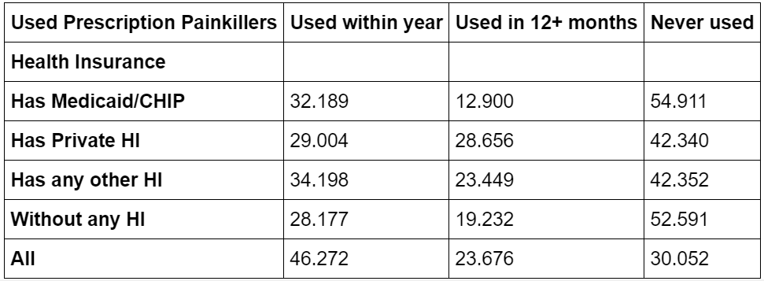
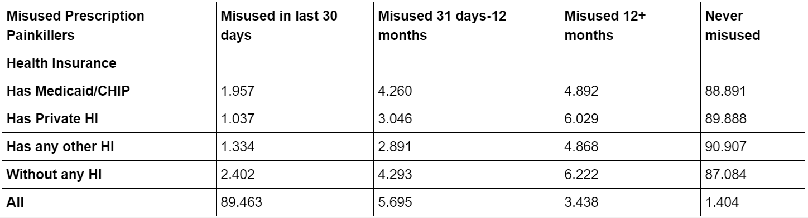
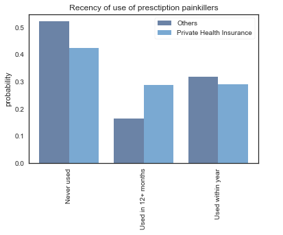

# Report
#### Filipe F. Borba and Micah H. Reid

## How does health insurance affect rates of use and abuse of opioids?
There has been research showing that [health insurance can lead to prescription opioid overuse, fueling the opioid epidemic.](https://www.jhsph.edu/news/news-releases/2018/health-insurance-plans-may-be-fueling-opioid-epidemic.html) However, there has been little done to look into variations across insurance types, or comparative rates of use and abuse between the insured and uninsured.
Our goal is to identify weak points in the American healthcare system that could be investigated to pinpoint opioid dependency factors, through the analysis of opioid use and abuse across populations with private, public, or no health insurance.

## Methodology
For this project we used data from the National Survey on Drug Use and Health from the year 2017. We investigated variables related to prescription painkiller use and misuse, compared against the categorical variable of health insurance type. This project does not account for trends over time, and is only meant to reflect recent history.

When comparing data, we normalized the population sizes so as not to have an outsized effect from those who have private health insurance, which was a substantially larger population group in our data set.

We compared through cross tabulations recency of prescription painkiller use and misuse over groupings based on health insurance. We also explored combined groupings with health insurance, using the variable of having ever used prescription painkillers.

## Results
We found that across the board, those with private health insurance were more likely to have used prescription painkillers within their lifetime, with 57.3% of those with private insurance having used prescription painkillers, versus 45% with Medicaid/CHIP and 47.4% of those without insurance.

#### All participants

 

However, those with private insurance were slightly less likely to have abused painkillers. 11.1% of those with Medicaid and 13% of those without insurance had ever abused painkillers, versus only 10.1% of those with private insurance.

 

We also included a variable for other types of health insurance which were not sorted. Because this grouping is not intentionally defined, it will be excluded from analysis, but it could be factored in at a later time if a study is done with more detail on which people fall into this category.

These crosstabs also included information on recency of use, but it is difficult to make sense of recency when taking into account those who had never used painkillers at all. Because of this, we created the same crosstabs and filtered for those who had ever used painkillers in their lifetime.

#### Misuse by those who have taken painkillers in the past

 

24.6% of those with Medicaid/CHIP and 27.2% of those without health insurance in this category had misused painkillers, versus only 17.6% of those with private health insurance. This suggests a very high overall conversion rate of use to misuse, but the nearly 10 percentage point difference between those with private health insurance and no health insurance indicates that this is a likely factor in misuse.

We also found that those with private health insurance were much more likely to have misused in the past, which implies they either never developed the habit or overcame it.

#### Recency of use by those who have taken painkillers in the past

 
While there were clear relationships in misuse, the total percentage of people who had misused painkillers was low, even controlling for those who had used painkillers at some point in their life. We decided to also investigate continued use of painkillers. While the data did not include first usages or time period of usage, we were able to compare recency between the groups. We found that of those who had ever used prescription painkillers, those with Medicaid had a 71% probability of having used painkillers in the past year, compared to 50% and 59% for private or no health insurance, respectively. This is a strong indicator that those with Medicaid are staying on painkillers for noticeably longer time periods.

We found that the relatively lower rate of misuse for those with private health insurance (versus public or no health insurance) became even more pronounced when viewing only those who had used prescription painkillers at some point in time.  

## Analysis
 As shown in previous studies, having health insurance can increase rates of opioid use. However, while there is still a probability of abuse for those who have used opioids in any group, this abuse is more likely in populations without private health insurance.

This difference in probabilities of abuse between insurance types suggests that there is a factor related to health insurance that is causing abuse. We don't have enough data to say that the health insurance itself is the cause, but health insurance type is closely tied with socioeconomic factors, rates of disability, and military affiliation. Those with disabilities earn 37% less on average (American Psychological Association), which could imply that they are more likely to rely on social benefits or go without insurance. It seems logical that there would be a link between disability and pain, so the increased duration and frequency painkiller use could partially or fully be due to more legitimate reasons related to medical conditions. This increase of continued use and abuse in those without private health insurance could be due to any hardships from being in these lower socioeconomic status groups, or it could be from the limit to access of care. Access to healthcare in both frequency and quality is limited without private health insurance, so this could be tied to self-medication when prescriptions are not available.

The other notable difference between the groups is the probability of opioid abuse being in the distant past rather than being recent or continued is much higher in the group with private health insurance. A likely explanation could be that increased financial and medical resources help people to overcome dependencies. We did not investigate frequency of misuse since frequency of use data was not available, which we felt would make for an incomplete comparison. However, because we did not study frequency, it is also possible that people in this group were never dependent in the first place, and these uses and abuses were one time occurrences.

#### Comparison: recency of use of painkillers by private health insurance vs others

 

A further study should be done on users with a history of opioid use (prescribed or otherwise). In this future study variables related to frequency of doctor's visits, coverage of prescriptions, ability to pay for prescriptions and doctor's visits, rates of disability and chronic pain, frequency of misuse within time periods, and other factors related to access to healthcare should be tracked. After we are able to control for these variables, we can start to test causation hypotheses.
